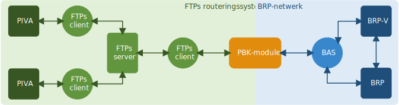
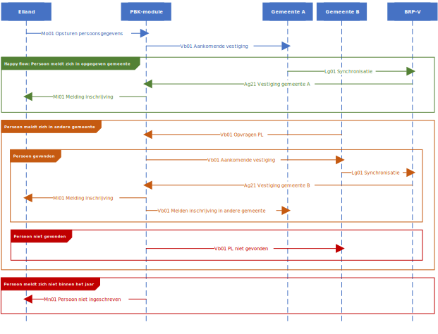
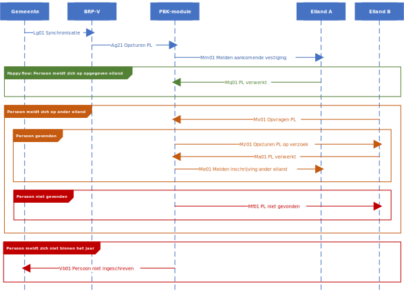
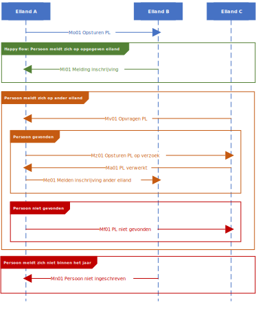
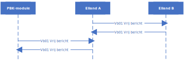
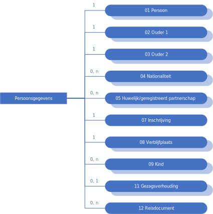

//Titel
= Logisch Ontwerp PBK
//Document attributen - moeten direct onder de titel geplaatst zijn
:doctype: book
:docinfo1:
:version-label: Versie
:revnumber: 2025.Q4
:revdate: 11 november 2025
:!chapter-signifier:
:appendix-caption: Appendix
:table-caption: Tabel
:figure-caption: Figuur
:sectnums:
:sectnumlevels: 4
:toc: left
:toc-title: Inhoud
:toclevels: 3
:xrefstyle: basic
:chapter-refsig: hoofdstuk
:section-refsig: paragraaf
:appendix-refsig: appendix
:stem: latexmath
:eqnums: all

//Wijzigingenoverzicht - geen genummerde paragraaf 

== Inleiding

Curaçao, Aruba, Sint Maarten (CAS-eilanden), Bonaire, Sint Eustatius en Saba (BES-eilanden) en Nederland kennen verschillende basisregistraties voor persoonsgegevens. De Europees Nederlandse gemeenten slaan hun bevolkingsadministratie op in de basisregistratie personen (https://www.rvig.nl/lo-brp[BRP]). De zes eilanden doen dat elk in hun eigen https://www.rvig.nl/logisch-ontwerp-bes[PIVA], dat vrijwel identiek is aan de BRP. In het kader van het bestuursakkoord ‘Uitwisseling persoonsgegevens binnen het Koninkrijk’ wisselen die zeven basisregistraties gegevens met elkaar uit over hun inwoners. RvIG beheert de voorziening die ervoor zorgt dat dat op een veilige en betrouwbare manier gebeurt: de PIVA-BRP Koppeling (PBK-module).

Het Logisch Ontwerp PBK beschrijft de opzet en de werking van de PBK-module en de functionele en technische eisen die RvIG stelt aan de erop aansluitende partijen. Die eisen kunnen aan verandering onderhevig zijn. In dat geval publiceert RvIG een <<_versiehistorie,nieuwe versie>> van het Logisch Ontwerp PBK, met een nieuw <<_versienummering,versienummer>>.

De eerste versie van het LO PBK trad in werking op 1 september 2001 (bij besluit van de Minister voor Grote Steden- en Integratiebeleid van 27 augustus 2001), nadat de Nederlandse regering op 8 januari 1999 een bestuursakkoord had gesloten met de autoriteiten van het Caribisch deel van het Koninkrijk inzake de uitwisseling van persoonsgegevens tussen de verschillende bevolkingsadministraties.

=== Opbouw Logisch ontwerp PBK

De volgende pagina’s lichten de verschillende aspecten van de PBK-module nader toe.

[horizontal,labelwidth=25%,itemwidth=75%]
<<_architectuur,Achitectuur>>:: Om een overzicht te geven van de werking van de PBK-module, bevat het Logisch ontwerp een korte beschrijving van de verschillende onderdelen en hun samenhang.
<<_scenarios,Scenario's>>:: De PBK-module handelt drie hoofdscenario’s af waarin er gegevens van persoonslijsten worden uitgewisseld. Die scenario’s worden toegelicht aan de hand van berichtencycli, die weergeven in welke volgorde de verschillende berichten over en weer gaan. De berichtdefinities staan in het <<_berichtenboek,Berichtenboek>>
<<_gegevenswoordenboek,Gegevenswoordenboek>>:: De PBK-module beheert en verwerkt de feitelijke (persoons)gegevens die de basisadministraties elkaar sturen. Niet alle categorieën van de persoonslijsten van PIVA en BRP mogen uitgewisseld worden. En binnen de categorieën die wel zijn toegestaan, zijn weer niet alle elementen onderdeel van de uit te wisselen set. Het gegevenswoordenboek van de PBK-module beschrijft exact welke elementen wel en welke niet worden uitgewisseld. Hoe die gegevens in berichten zijn opgenomen, staat in het <<_berichtenboek,Berichtenboek>>.
<<_berichtenboek,Berichtenboek>>:: De basisadministraties versturen en ontvangen via de PBK-module verschillende berichten. Het berichtenboek beschrijft hoe die berichten zijn opgebouwd, en wat hun inhoud is. Een nadere toelichting van die inhoud vind je in het <<_gegevenswoordenboek,Gegevenswoordenboek>>.
<<_verklarende_woordenlijst,Woordenlijst>>:: Het LO bezigt hier en daar specifieke termen of afkortingen; de woordenlijst verklaart deze.

=== Versiebeheer

==== Versiehistorie

[width="100%",cols="25%a,75%a",options="header"]
|===
|Versie |Inhoud
|2025.Q2 (1 april 2025) |Geheel herziene versie (achterstallig onderhoud, dubbele beschrijvingen eruit, nieuwe afbeeldingen, eenvoudigere structuur).
|2025.Q4 (11 november 2025) |Invoering BSN in Caribisch Nederland
|{nbsp} |{nbsp}
|{nbsp} |{nbsp}
|{nbsp} |{nbsp}
|===

[[versienummering]]
==== Versienummering

Van het Logisch Ontwerp PBK verschijnt onregelmatig een nieuwe versie. Het Logisch Ontwerp is voorzien van een versienummer en een versiedatum in de volgende notatie:

* Versienummer: jjjj.Qn++[++.m++]++ waarin:
** jjjj het jaartal van verschijnen is
** Q staat voor ‘kwartaal’
** n het kwartaalnummer van verschijnen is, zodat het versienummer het tijdstip van inwerkingtreding als volgt weerspiegelt: +
+
[width="50%",cols="45%,55%",options="header",align="left"]
|===
|Kwartaalnummer |Inwerkingtreding
|1 |januari-maart
|2 |april-juni
|3 |juli-september
|4 |oktober-december
|===
+
** m het volgnummer van een eventuele tussentijdse release is, met dien verstande dat het volgnummer 0 van een hoofdrelease wordt weggelaten.
* Versiedatum: dd ++<++maand++>++ jjjj.

== Architectuur

=== Componenten in de berichtuitwisseling PIVA-BRP

De PIVA-applicaties van de zes eilanden wisselen persoonsgegevens uit met elkaar en met de BRP middels elektronisch berichtenverkeer. De hardware en programmatuur waarmee PIVA het berichtenverkeer beveiligt, verzendt en ontvangt, bevindt zich in een apart systeem, de PIVA FTPs-client. Het berichttransport gaat via gesloten verbindingen, met behulp van routeringssoftware gecombineerd met een FTPs-server. Dit gesloten netwerk heeft dezelfde technische kenmerken als Gemnet, waarmee de Nederlandse gemeenten berichten uitwisselen. Een digitale handtekening (certificaat) en encryptie beveiligen de berichtenstroom. Dit garandeert de integriteit en vertrouwelijkheid van de uitgewisselde persoonsgegevens.

De eilanden onderling kunnen direct berichten met elkaar uitwisselen, en met de verstrekkingsvoorziening van de BES-eilanden PIVA-V. Ze gebruiken daarvoor het routeringssysteem van de PBK-module. Een PIVA-systeem legt in de regel eenmaal per dag contact met de PBK-module om berichten op te halen en te verzenden. Er is een set berichten gedefinieerd voor de communicatie tussen de eilanden onderling en tussen de eilanden en de PBK-module. Meer informatie over de inhoud van de berichten staat in het <<_berichtenboek,Berichtenboek>>. Hoe de berichten technisch verstuurd worden, staat in <<_verzenden_en_ophalen_van_berichten>>.

De PBK-module fungeert als een brug tussen de PIVA-systemen en de BRP-omgeving. De module is zowel aangesloten op het FTPs-routeringssysteem als op het BRP-netwerk via een Berichtafhandelingssysteem (BAS). Op die manier is berichtuitwisseling tussen BRP(-V) en PIVA mogelijk. Voor de berichten tussen BRP-stelsel en de PBK-module is echter geen specifieke set gedefinieerd; daar vindt de uitwisseling plaats op basis van Vrije berichten. De PBK-module zet die Vrije berichten om in PIVA-berichten en vice versa. De berichten die over de lijn gaan, volgen de structuur van de berichten uit het BRP-stelsel.

RvIG Gegevensbeheer is de beheerder van de PBK-module. Een medewerker van RvIG moet inloggen, om taken in het systeem te kunnen uitvoeren.

Onderstaand diagram geeft de verschillende componenten van de berichtuitwisseling weer. Om duidelijk te maken dat de PIVA’s elkaar ook berichten kunnen versturen, zijn twee PIVA’s ingetekend, maar het geldt uiteraard voor alle zes. En ook voor PIVA-V, dat hier niet is ingetekend, omdat de synchronisatie met PIVA-V (middels Lg01-berichten) uitgebreid in het LO BES wordt beschreven.

[.text-center,#componenten-in-de-berichtenuitwisseling]
.Componenten in de berichtenuitwisseling

=== Typen berichten

Als een gebruiker van PIVA een migratie vastlegt naar Nederland of naar een van de andere eilanden, genereert PIVA een bericht voor de FTPs-client, gericht aan de gewenste ontvanger. De FTPs-client vercijfert het bericht en voorziet het van een digitale handtekening. Vervolgens stuurt die het op naar de FTPs-server behorende bij de PBK-module. Betreft het een migratie naar een ander eiland, dan zet de PBK-module het bericht klaar in de folder van dat eiland. Dat kan het bericht daar vervolgens zelf ophalen en verwerken.

Migreert de persoon naar een Nederlandse gemeente, dan slaat de PBK-module de gegevens uit het bericht tijdelijk op in haar database en genereert met die gegevens een Vrij bericht voor de gemeente, dat zij met het BAS verstuurt via het BRP-netwerk. Als een gebruiker van een gemeentelijke BRP een Vrij bericht naar een van de eilanden wil versturen, doet hij dat via het BAS van de PBK-module.

Van een aangekondigde migratie van een Nederlandse gemeente naar een van de eilanden ontvangt de PBK-module automatisch bericht van de verstrekkingsvoorziening van de BRP, de BRP-V. De PBK-module fungeert als afnemer van conditionele verstrekkingen uit BRP-V en ontvangt dus een bericht, zodra de sleutelrubrieken op een PL wijzigen, die ervoor zorgen dat de PL voldoet aan de voorwaardenregel van de PBK-module. Dat bericht bevat de gegevens waarvoor de PBK-module geautoriseerd is voor spontane verstrekking. De betreffende sleutelrubrieken zijn en bijbehorende voorwaarde zijn:

[unordered.stack]
08.13.10 Land adres buitenland:: Zodra een PL wordt opgeschort met reden E, en in het land adres buitenland wordt een van de zes eilanden geregistreerd, stuurt BRP-V een bericht aan de PBK-module om de aankomende migratie aan te kondigen.
08.14.10 Land vanwaar ingeschreven:: Zodra een persoon wordt ingeschreven afkomstig van een van de zes eilanden stuurt BRP-V een bericht aan de PBK-module ter bevestiging.

=== Verzenden en ophalen van berichten

Elke deelnemer (de zes eilanden, maar ook PIVA-V) heeft op de FTPs-server van de PBK-module een eigen folder, waar hij berichten kan neerzetten of ophalen. Om bij die folder te komen, moet een deelnemer zich aanmelden via de PIVA FTPs-client. De FTPs-server identificeert hem en voorziet hem van de juiste rechten. Iedere deelnemer communiceert alleen met zijn eigen folders en de routeringmodule zorgt ervoor dat de PIVA-berichten in de folder van de betreffende deelnemer terecht komen.

Elk bericht dat een deelnemer wil versturen, komt terecht in zijn PIVA++_++UIT directory. De FTPs-software plaatst het bericht vervolgens in de PIVA++_++IN directory van de geadresseerde. De berichtbestanden hebben een naam die als volgt is opgebouwd:

*PANNNNNN.XXX*

waarin de letters de volgende betekenis/inhoud hebben:

* *P* = PIVA-berichttype, afgeleid van de tweede positie van de berichtnaam: +
+
[width="80%",cols="10%,20%,10%,20%,10%,30%",align="left"]
|===
|O |<<Mo01,Mo01>> |Q |<<Mq01,Mq01>> |A |<<Ma01,Ma01>>
|M |<<Mm01,Mm01>> |V |<<Mv01,Mv01>> |E |<<Me01,Me01>>
|I |<<Mi01,Mi01>> |Z |<<Mz01,Mz01>> |F |<<Pf01,Pf01>>, <<Pf02,Pf02>>, <<Pf03,Pf03>>
|N |<<Mn01,Mn01>> |F |<<Mf01,Mf01>> |B |<<Vb01,Vb01>>
6+|_De berichten naar PIVA-V ontbreken hier, omdat ze staan beschreven in Logisch Ontwerp BES._
|===
+
* *A* = Afzender, met de mogelijke waarden: +
+
[width="60%",cols="15%,35%,15%,35%",align="left"]
|===
|1 |Aruba |4 |Saba
|2 |Bonaire |5 |Sint Eustatius
|3 |Curaçao |6 |Sint Maarten
|===
+
* *NNNNNN* = laatste 6 posities van het referentienummer van het bericht
* *XXX* = de bestandsextensie van de ontvanger van het bericht (volgens onderstaande tabel): +
+
[width="90%",cols="25%,25%,25%,25%",options="header",align="left"]
|===
|Naam |Ontvanger |Bestandsextensie |Bestemmingsmap
|Aruba |3001010 |001 |FTPS/3001/in
|Bonaire |3002010 |002 |FTPS/3002/in
|Curaçao |3003010 |003 |FTPS/3003/in
|Saba |3004010 |004 |FTPS/3004/in
|Sint Eustatius |3005010 |005 |FTPS/3005/in
|Sint Maarten |3006010 |006 |FTPS/3006/in
|PIVA-V |3009290 |009 |FTPS/3009/in
|===

De combinatie afzender, referentienummer waarborgt een unieke bestandsnaam per deelnemer. Ook maakt de bestandsnaam direct duidelijk wie het bericht verstuurd heeft en wie het zal ontvangen.

=== Modulaire en ontkoppelde architectuur

De architectuur is modulair van opzet: De componenten zijn op losse wijze met elkaar gekoppeld. Daardoor is het mogelijk componenten toe te voegen, te wijzigen of te verwijderen, zonder de stabiliteit en functionaliteit van de overige componenten in gevaar te brengen. Ook kunnen componenten daardoor meerdere keren ingezet worden in verschillende modules. En kunnen ze op verschillende fysieke systemen draaien, zodat de applicatie schaalbaar blijft bij toekomstige wijzigingen. De architectuur is zodoende onafhankelijk van hardware, operating systeem, database en beveiligingsmaatregelen.

De te verzenden data en de functionaliteit van het verzenden zijn zoveel mogelijk gescheiden van elkaar. Hierdoor kan de inhoud van de berichten tot op zekere hoogte wijzigen, zonder bijvoorbeeld de routering- of encryptiecomponenten aan te passen.

== Scenario’s

De PBK-module handelt in feite drie hoofdscenario’s af waarin er gegevens van persoonslijsten worden uitgewisseld:

. Een persoon migreert van een eiland naar een Nederlandse gemeente;
. Een persoon migreert van een Nederlandse gemeente naar een eiland;
. Een persoon migreert van het ene eiland naar het andere.

Daarnaast kunnen de eilanden onderling naar elkaar of naar de PBK-module Vrije berichten verzenden.

Elk scenario kent een happy flow en enkele unhappy flows. Dit LO beschrijft alleen de functionele scenario’s en uitzonderingen. Technische uitzonderingen, zoals transmissiefouten, laten we buiten beschouwing.

Onderstaande afbeeldingen geven de berichtencycli weer waarmee de scenario’s worden afgewikkeld. De berichtdefinities staan uitgewerkt in het <<_berichtenboek,Berichtenboek>>. Alle berichtencycli kunnen eindigen in een protocolfout, in geval dat er een fout optreedt. Een beschrijving van de protocolfouten is te vinden in het https://www.rvig.nl/lo-brp[Logisch Ontwerp BRP].

=== Migratie van eiland naar Nederlandse gemeente

[.text-center,#berichtenuitwisseling-bij-migratie-van-eiland-naar-gemeente]
.Berichtenuitwisseling bij een migratie van een eiland naar een Nederlandse gemeente

Een persoon komt naar de afdeling burgerzaken op het eiland waar hij momenteel is ingeschreven. Hij meldt daar dat hij gaat emigreren naar Nederland en geeft daarbij de gemeente op waar hij zich wil vestigen. De ambtenaar van dienst registreert de emigratie in PIVA en geeft de persoon een uitschrijfbewijs mee. De PIVA van het eiland stuurt een bericht van de aankomende migratie naar de PBK-module (<<Mo01,Mo01>>), met daarin de persoonsgegevens van de betreffende persoon. De PBK-module slaat die gegevens tijdelijk op, genereert een Vrij bericht (<<Vb01,Vb01>>) en stuurt dat naar de opgegeven gemeente.

==== Happy flow

Zodra de persoon zich in de gemeente meldt, zoekt de ambtenaar van Burgerzaken op basis van het PIVA-uitschrijfbewijs het Vrije bericht van de PBK-module erbij, en gaat hij na of de persoon al in de BRP voorkomt, middels een presentievraag aan de Beheervoorziening BSN (BV BSN).

* Komt de persoon voor in de BRP (als niet-ingezetene), dan haalt hij de PL op uit de Registratie Niet Ingezetenen (RNI) en actualiseert hem aan de hand van de gegevens uit het Vrije bericht en eventuele bron- en identificatiedocumenten. Dit geldt per definitie voor personen afkomstig van een BES-eiland, omdat de RNI een kopie van hun PIVA-PL bijhoudt zolang zij ingeschreven zijn op het eiland.
* Komt de persoon niet voor in de BRP, dan legt de ambtenaar een nieuwe PL aan. Hij gebruikt daarbij het A-nummer van de PIVA-PL.

De BRP-V ontvangt van de gemeente een Lg01-bericht over de inschrijving, waardoor een sleutelrubriek uit de BRP-autorisatietabelregel van de PBK-module wijzigt. Op basis daarvan stuurt BRP-V een conditionele verstrekking (<<Ag21,Ag21>>) naar de PBK-module. Die meldt aan het eiland van vertrek dat de persoon zich in de Nederlandse gemeente heeft ingeschreven (met een <<Mi01,Mi01>>), en verwijdert de persoonsgegevens die zij tijdelijk had opgeslagen.

==== Persoon meldt zich in andere gemeente 

De persoon meldt zich niet in de gemeente die van de PBK-module een bericht heeft ontvangen, maar in een andere. Die ambtenaar van die andere gemeente vraagt bij de PBK-module om de gegevens van de persoon met een Vrij bericht (<<Vb01,Vb01>>). Hij zorgt ervoor dat er in dat bericht voldoende gegevens staan om de persoon uniek te identificeren. Omdat hiervoor geen specifiek bericht is gedefinieerd, moet de beheerder van de PBK-module bij RvIG handmatig de gevraagde persoon opzoeken.

* Als hij de persoon in de PBK-module kan vinden, stuurt hij in een Vrij bericht de gevraagde gegevens terug. De ambtenaar van de gemeente volgt vervolgens de procedure zoals beschreven in de link:#happy-flow[happy flow]. Zodra de PBK-module de conditionele verstrekking (<<Ag21,Ag21>>) van BRP-V heeft ontvangen, brengt zij zowel het eiland van vertrek op de hoogte (met een <<Mi01,Mi01>>) als de gemeente die de persoon oorspronkelijk op het oog had als vestigingsplaats (via een <<Vb01,Vb01>>). Daarna verwijdert zij de persoonsgegevens die zij tijdelijk had opgeslagen.
* Als hij de persoon niet in de PBK-module kan vinden, meldt hij dat in een <<Vb01,Vb01>> aan de gemeente die de persoonsgegevens had opgevraagd.

==== Persoon meldt zich niet

Als de persoon zich niet binnen een jaar heeft ingeschreven in de opgegeven of een andere gemeente (en de PBK-module dus al die tijd geen melding van inschrijving (<<Ag21,Ag21>>) of verzoek om persoonsgegevens (<<Vb01,Vb01>>) heeft ontvangen), stuurt de PBK-module een seintje naar het eiland van vertrek met een <<Mn01,Mn01>>. Daarna verwijdert zij de persoonsgegevens die zij tijdelijk had opgeslagen.

=== Migratie van Nederlandse gemeente naar eiland

[.text-center,#berichtenuitwisseling-bij-migratie-van-gemeente-naar-eiland]
.Berichtenuitwisseling bij een migratie van een Nederlandse gemeente naar een eiland

Een persoon meldt aan de balie burgerzaken van de Nederlandse gemeente waar hij momenteel staat ingeschreven dat hij emigreert naar een van de eilanden in het Caribisch deel van het Koninkrijk. De ambtenaar van dienst actualiseert zijn persoonslijst met het aanstaande adres op het betreffende eiland in het adres buitenland en schort de PL op met reden E (Emigratie). Hij geeft de persoon een uitschrijfbewijs mee.

De persoonslijst gaat over naar de RNI, en de BRP-V wordt bijgewerkt via een Lg01 synchronisatiebericht. Die verstuurt daarop met een <<Ag21,Ag21>>-bericht de persoonsgegevens aan de PBK-module (conditionele verstrekking). De PBK-module slaat die gegevens tijdelijk op, en bericht het opgegeven eiland over de aankomende vestiging van de persoon (<<Mm01,Mm01>>).

==== Happy flow

Bij aankomst op het eiland meldt de persoon zich bij de afdeling burgerzaken. Op basis van het uitschrijfbewijs dat de persoon bij zich heeft, zoekt de ambtenaar de persoonsgegevens op die de PBK-module heeft aangeleverd. Hij gaat vervolgens na of de persoon al is ingeschreven in de PIVA van het eiland. Is dat het geval, dan zal de ambtenaar de bestaande PL actualiseren met gegevens uit het bericht (<<Mm01,Mm01>>) van de PBK-module of eventuele bron- en identiteitsdocumenten. Anders legt hij een nieuwe PL aan. Daarbij neemt hij het A-nummer uit de BRP over, en in geval van de drie BES-eilanden ook het BSN.

Nadat de inschrijving is voltooid, brengt de PIVA de PBK-module daarvan op de hoogte met een bericht (<<Mq01,Mq01>>). Naar aanleiding hiervan verwijdert de PBK-module de tijdelijk opgeslagen persoonsgegevens.

==== Persoon meldt zich op ander eiland 

De persoon meldt zich niet op het eiland dat van de PBK-module een bericht heeft ontvangen, maar op een ander. De ambtenaar op dat eiland vraagt de PBK-module op basis van de gegevens op het uitschrijfbewijs om de gegevens (<<Mv01,Mv01>>).

* Als de PBK-module de persoon kan vinden in zijn database, stuurt zij de gevraagde gegevens terug (<<Mz01,Mz01>>). Vervolgens volgt de ambtenaar de in de happy flow beschreven procedure van inschrijving. Na afronding daarvan stuurt PIVA een bericht (<<Ma01,Ma01>>) naar de PBK-module ter bevestiging. Die stelt het oorspronkelijke eiland van vestiging (met een <<Me01,Me01>>) op de hoogte. Daarna verwijdert zij de persoonsgegevens die zij tijdelijk had opgeslagen.
* Als de PBK-module de persoon niet kent, meldt zij dat in een <<Mf01,Mf01>>-bericht aan het eiland dat de gegevens had opgevraagd.

==== Persoon meldt zich niet

Als de persoon zich niet binnen een jaar heeft ingeschreven op het opgegeven of een ander eiland (en de PBK-module dus al die tijd geen melding van inschrijving (<<Mq01,Mq01>> of <<Ma01,Ma01>>) of verzoek om persoonsgegevens (<<Mv01,Mv01>>) heeft ontvangen), stuurt de PBK-module een seintje naar de gemeente van vertrek via een vrij bericht (<<Vb01,Vb01>>). Daarna verwijdert zij de persoonsgegevens die zij tijdelijk had opgeslagen.

=== Migratie tussen eilanden

[.text-center,#berichtenuitwisseling-bij-migratie-tussen-eilanden]
.Berichtenuitwisseling bij een migratie tussen twee eilanden

Een persoon meldt zich aan de balie Burgerzaken van het eiland waar hij op dat moment woont, en kondigt zijn vertrek naar een van de vijf andere eilanden in het Caribisch deel van het Koninkrijk aan. De ambtenaar registreert het nieuwe adres op de persoonslijst in het adres buitenland in de PIVA en schort de PL vervolgens op met reden E (Emigratie). Hij geeft de persoon een uitschrijfbewijs mee. De PIVA van het eiland van vertrek stuurt een bericht van de aankomende migratie naar het eiland van vesting (<<Mo01,Mo01>>), met daarin de persoonsgegevens van de betreffende persoon.

==== Happy flow

Als de persoon zich op het eiland van vestiging meldt dat hij bij zijn vertrek had opgegeven, zoekt de ambtenaar aldaar op basis van het uitschrijfbewijs het toegezonden <<Mo01,Mo01>>-bericht op. Hij controleert vervolgens of de persoon al eerder ingeschreven is geweest op het eiland. Als dat het geval is, actualiseert hij de al bestaande PL. Anders schrijft hij de persoon in, en neemt daarbij het A-nummer van het eiland van vertrek over. Is er sprake van een verhuizing tussen twee BES-eilanden , dan neemt hij ook het BSN over; bij een verhuizing van of naar een CAS-eiland is dit niet van toepassing. Na de inschrijving genereert de PIVA een bericht ter bevestiging aan het eiland van vertrek (<<Mi01,Mi01>>).

==== Persoon meldt zich op ander eiland 

De persoon meldt zich niet op het eiland dat het bericht over de aanstaande vestiging heeft ontvangen, maar op een van de andere eilanden in het Caribisch deel van het Koninkrijk. De ambtenaar daar kan dus geen <<Mo01,Mo01>>-bericht van deze persoon vinden en vraagt dat middels een <<Mv01,Mv01>> op bij het eiland van vertrek (dat op het uitschrijfbewijs vermeld staat).

* Als dat eiland de gevraagde gegevens kan vinden, stuurt het die op in een <<Mz01,Mz01>>. Vervolgens volgt de ambtenaar de in de happy flow beschreven procedure van inschrijving. Na afronding daarvan stuurt PIVA een bericht ter bevestiging (<<Ma01,Ma01>>) naar het eiland van vertrek. Dat verwittigt op zijn beurt via een <<Me01,Me01>> het oorspronkelijke eiland van vestiging, dat de persoon zich op een ander eiland heeft ingeschreven. Dat oorspronkelijke eiland verwijdert daarop de aankondiging van de emigratie (<<Mo01,Mo01>>).
* Als het eiland de gevraagde persoon niet kent, meldt hij dat in een <<Mf01,Mf01>>-bericht aan het eiland dat de gegevens had opgevraagd.

==== Persoon meldt zich niet

Als de persoon zich niet binnen een jaar heeft ingeschreven op het opgegeven eiland, stuurt dat eiland daarover een bericht naar het eiland van vertrek (<<Mn01,Mn01>>); en verwijdert daarna het <<Mo01,Mo01>>-bericht dat de emigratie een jaar geleden had aangekondigd.

=== Vrije berichten

[.text-center,#uitwisseling-van-vrije-berichten]
.Uitwisseling van vrije berichten

De eilanden kunnen vrije berichten (<<Vb01,Vb01>>) uitwisselen met elkaar en met de PBK-module.

=== Rapportage en beheer

De PBK-module beheert en verwerkt de feitelijke gegevens die de eilanden en de Nederlandse gemeenten uitwisselen. Daarnaast biedt de module ook de mogelijkheid managementinformatie te verwerken tot statistische rapportages; en de migratiestromen binnen het Koninkrijk over een bepaalde periode in kaart te brengen. Hierin zijn geen persoonsgegevens verwerkt.

Het komt voor dat de PBK-module bepaalde berichten/persoonsgegevens niet automatisch kan verwijderen, bijvoorbeeld als zij op basis van de ontvangen informatie de opgevraagde persoon niet of niet ondubbelzinnig kan identificeren. In dat geval zal de beheerder van de PBK-module de gegevens handmatig verwijderen. De verzender van het handmatig verwijderde bericht ontvangt hierover altijd een melding: een Nederlandse gemeente een <<Vb01,Vb01>>; een eiland een <<Mn01,Mn01>>.

== Gegevenswoordenboek

Het gegevenswoordenboek van de PBK-module beschrijft exact welke gegevens de eilanden elektronisch met elkaar en met Nederlandse gemeenten uitwisselen volgens het bestuursakkoord dat de Nederlandse regering op 8 januari 1999 heeft gesloten met de autoriteiten van het Caribisch deel van het Koninkrijk.

=== Uitgewisselde categorieën

Zeker niet alle gegevens op de persoonslijsten van PIVA en BRP worden uitgewisseld. Onderstaand datamodel geeft weer om welke subset aan categorieën het gaat. Bevat een categorie in het model een schaduwrand, dan betekent dat, dat ook de historische categorieën meegaan in de berichtenstroom.

[.text-center,#uitgewisselde-categorieen]
.Uitgewisselde categorieën gegevens op de persoonslijst

=== Niet uitgewisselde categorieën

De categorieën waarvan het geen zin heeft ze uit te wisselen, zijn:

[width="100%",cols="5%,25%,70%",options="header",]
|===
2+|Categorie |Reden dat de categorie niet uitgewisseld wordt
|06 |Overlijden |De eilanden wisselen alleen gegevens van levende personen uit met elkaar en met de Nederlandse gemeenten.
|10 |Verblijfstitel |In het LO BES komt de categorie 10 Verblijfsvergunning voor en in het LO BRP de categorie 10 Verblijfstitel. Een verblijfstitel in Nederland betekent niets op de eilanden en een verblijfsvergunning op de eilanden betekent niets in Nederland of een ander eiland.
|13 |Kiesrecht |Zowel in het LO BES als in het LO BRP komt de categorie 13 Kiesrecht voor. De inhoud van die categorie in het ene deel van het Koninkrijk heeft echter geen betekenis in de andere delen van het Koninkrijk.
|14 |Afnemersindicatie |Deze categorie heeft alleen betekenis in de gegevensverstrekking aan afnemers, wat bij de gegevensuitwisseling binnen het Koninkrijk niet aan de orde is.
|16 |Tijdelijk verblijfadres |Deze categorie komt alleen in de RNI van de BRP voor, niet in de PIVA.
|17 |Contactgegevens |Deze categorie komt alleen in de RNI van de BRP voor, niet in de PIVA.
|21 |Verwijzing |Deze categorie komt alleen in de BRP voor, niet in de PIVA.
|===

=== Uitgewisselde gegevens

In de uitgewisselde categorieën zijn niet alle elementen opgenomen. Onderstaande tabellen sommen alle categorieën, groepen en elementen op die een eiland of Nederlandse gemeente via de PBK-module kan versturen. Voor de duidelijkheid noemen we ook de elementen die ‘buiten de boot vallen’. Wanneer overigens de naamgeving van elementen afwijkt tussen PIVA en BRP is het gegevenswoordenboek uit het Logisch Ontwerp BRP leidend.

==== Persoon

[width="100%",cols="8%,12%,8%,27%,8%,37%",options="header",]
|===
2+|Categorie 2+|Groep 2+|Element
.16+|01/51 .16+|Persoon .2+|01 .2+|Identificatie­nummers |01.10 |A-nummer
|01.20 |Burgerservicenummer
.4+|02 .4+|Naam |02.10 |Voornamen
|02.20 |Adellijke titel/predicaat
|02.30 |Voorvoegsel geslachtsnaam
|02.40 |Geslachtsnaam
.3+|03 .3+|Geboorte |03.10 |Geboortedatum
|03.20 |Geboorteplaats
|03.30 |Geboorteland
|04 |Geslacht |04.10 |Geslachtsaanduiding
|61 |Naamgebruik |61.10 |Aanduiding naamgebruik
.2+|81 .2+|Akte |81.10 |Registergemeente akte
|81.20 |Aktenummer
.3+|82 .3+|Document |82.10 |Gemeente document
|82.20 |Datum document
|82.30 |Beschrijving document
|85 |Geldigheid |85.10 |Ingangsdatum geldigheid
|86 |Opneming |86.10 |Datum van opneming
|===

In de gegevensset uit het LO BES komt element 01.30 ID-nummer persoon voor. Dit nummer is alleen relevant op het eiland dat het heeft uitgegeven. Het is daarom niet zinvol dit element uit te wisselen. N.B. Dit geldt niet alleen voor categorie 01/51 Persoon, maar ook voor 02/52 Ouder1, 03/53 Ouder2, 05/55 Huwelijk/geregistreerd partnerschap en 09/59 Kind.

In de gegevensset van het LO BES komt element 01.20 Burgerservicenummer voor. Dit gegeven wordt alleen uitgewisseld tussen Nederland en de openbare lichamen Bonaire, Saba en Sint Eustatius, en tussen de openbare lichamen onderling. De Caribische landen Aruba, Curaçao en Sint Maarten gebruiken het burgerservicenummer niet. Daarom wordt dit nummer niet uitgewisseld als bij een verhuizing tenminste één van de Caribische landen is betrokken. N.B. Dit geldt niet alleen voor categorie 01/51 Persoon, maar ook voor 02/52 Ouder1, 03/53 Ouder2, 05/55 Huwelijk/geregistreerd partnerschap en 09/59 Kind.

Zowel in het LO BES als in het LO BRP komen de elementen 20.10 Vorig A-nummer en 02.20 Volgend A-nummer voor. Deze gegevens betekenen in de uitwisseling van gegevens binnen het Koninkrijk echter niets en ontbreken dus hier.

==== Ouder1

[width="100%",cols="8%,12%,8%,27%,8%,37%",options="header",]
|===
2+|Categorie 2+|Groep 2+|Element
.16+|02/52 .16+|Ouder1 .2+|01 .2+|Identificatie­nummers |01.10 |A-nummer
|01.20 |Burgerservicenummer
.4+|02 .4+|Naam |02.10 |Voornamen
|02.20 |Adellijke titel/predicaat
|02.30 |Voorvoegsel geslachtsnaam
|02.40 |Geslachtsnaam
.3+|03 .3+|Geboorte |03.10 |Geboortedatum
|03.20 |Geboorteplaats
|03.30 |Geboorteland
|04 |Geslacht |04.10 |Geslachtsaanduiding
|62 |Familierechtelijke betrekking |62.10 |Datum ingang familierechtelijke betrekking
.2+|81 .2+|Akte |81.10 |Registergemeente akte
|81.20 |Aktenummer
.3+|82 .3+|Document |82.10 |Gemeente document
|82.20 |Datum document
|82.30 |Beschrijving document
|85 |Geldigheid |85.10 |Ingangsdatum geldigheid
|86 |Opneming |86.10 |Datum van opneming
|===

==== Ouder2

[width="100%",cols="8%,12%,8%,27%,8%,37%",options="header",]
|===
2+|Categorie 2+|Groep 2+|Element
.17+|03/53 .17+|Ouder2 .2+|01 .2+|Identificatie­nummers |01.10 |A-nummer
|01.20 |Burgerservicenummer
.4+|02 .4+|Naam |02.10 |Voornamen
|02.20 |Adellijke titel/predicaat
|02.30 |Voorvoegsel geslachtsnaam
|02.40 |Geslachtsnaam
.3+|03 .3+|Geboorte |03.10 |Geboortedatum
|03.20 |Geboorteplaats
|03.30 |Geboorteland
|04 |Geslacht |04.10 |Geslachtsaanduiding
|62 |Familierechtelijke betrekking |62.10 |Datum ingang familierechtelijke betrekking
.2+|81 .2+|Akte |81.10 |Registergemeente akte
|81.20 |Aktenummer
.3+|82 .3+|Document |82.10 |Gemeente document
|82.20 |Datum document
|82.30 |Beschrijving document
|85 |Geldigheid |85.10 |Ingangsdatum geldigheid
|86 |Opneming |86.10 |Datum van opneming
|===

==== Nationaliteit

[width="100%",cols="8%,12%,8%,27%,8%,37%",options="header",]
|===
2+|Categorie 2+|Groep 2+|Element
.9+|04/54 .9+|Nationali­teit |05 |Nationaliteit |05.10 |Nationaliteit
|63 |Opnemen Nationaliteit |63.10 |Reden opname nationaliteit
|64 |Beëindigen nationaliteit |64.10 |Reden beëindigen nationaliteit
|65 |Bijzonder Nederlander­schap |65.10 |Aanduiding bijzonder Nederlanderschap
.3+|82 .3+|Document |82.10 |Gemeente document
|82.20 |Datum document
|82.30 |Beschrijving document
|85 |Geldigheid |85.10 |Ingangsdatum geldigheid
|86 |Opneming |86.10 |Datum van opneming
|===

In de gegevensset uit het LO BRP komt element 73.10 EU-persoonsnummer voor. Het Caribisch deel van het Koninkrijk registreert dit nummer niet en wisselt het dus niet uit.

==== Huwelijk/geregistreerd partnerschap

[width="100%",cols="8%,12%,8%,27%,8%,37%",options="header",]
|===
2+|Categorie 2+|Groep 2+|Element
.25+|05/55 .25+|Huwelijk/ geregistreerd partner­schap .2+|01 .2+|Identificatie­nummers |01.10 |A-nummer
|01.20 |Burgerservicenummer
.4+|02 .4+|Naam |02.10 |Voornamen
|02.20 |Adellijke titel/ predicaat
|02.30 |Voorvoegsel geslachtsnaam
|02.40 |Geslachtsnaam
.3+|03 .3+|Geboorte |03.10 |Geboortedatum
|03.20 |Geboorteplaats
|03.30 |Geboorteland
|04 |Geslacht |04.10 |Geslachtsaanduiding
.3+|06 .3+|Huwelijkssluiting/ aangaan geregistreerd partnerschap |06.10 |Datum huwelijkssluiting/ aangaan geregistreerd partnerschap
|06.20 |Plaats huwelijkssluiting/ aangaan geregistreerd partnerschap
|06.30 |Land huwelijkssluiting/ aangaan geregistreerd partnerschap
.4+|07 .4+|Ontbinding huwelijk/ geregistreerd partnerschap |07.10 |Datum ontbinding huwelijk/ geregistreerd partnerschap
|07.20 |Plaats ontbinding huwelijk/ geregistreerd partnerschap
|07.30 |Land ontbinding huwelijk/ geregistreerd partnerschap
|07.40 |Reden ontbinding huwelijk/ geregistreerd partnerschap
|15 |Soort verbintenis |15.10 |Soort verbintenis
.2+|81 .2+|Akte |81.10 |Registergemeente akte
|81.20 |Aktenummer
.3+|82 .3+|Document |82.10 |Gemeente document
|82.20 |Datum document
|82.30 |Beschrijving Document
|85 |Geldigheid |85.10 |Ingangsdatum geldigheid
|86 |Opneming |86.10 |Datum van opneming
|===

==== Inschrijving

[width="100%",cols="8%,12%,8%,27%,8%,37%",options="header",]
|===
2+|Categorie 2+|Groep 2+|Element
.4+|07 .4+|Inschrijving |68 |Opname |68.10 |Datum eerste inschrijving BRP
|69 |Gemeente PK |69.10 |Gemeente waar de PK zich bevindt
|70 |Geheim |70.10 |Indicatie geheim
|87 |PK-conversie |87.10 |PK-gegevens volledig geconverteerd
|===

Zowel in het LO BES als in het LO BRP komen de elementen 67.10 Datum opschorting bijhouding, 67.20 Reden opschorting bijhouding, 80.10 Versienummer en 80.20 Datumtijdstempel voor. Deze gegevens hebben voor de uitwisseling van gegevens binnen het Koninkrijk echter geen betekenis.

De elementen 66.10 Datum ingang blokkering PL, 71.10 Datum verificatie, 71.20 Omschrijving verificatie, 88.10 RNI-deelnemer en 88.20 Omschrijving verdrag komen alleen voor in de gegevensset van het LO BRP en niet in die van het LO BES. Het heeft dus geen zin die uit te wisselen.

==== Verblijfplaats

[width="100%",cols="8%,12%,8%,27%,8%,37%",options="header",]
|===
2+|Categorie 2+|Groep 2+|Element
.23+|08/58 .23+|Verblijf­plaats .2+|09 .2+|Gemeente |09.10 |Gemeente van inschrijving
|09.20 |Datum inschrijving
.3+|10 .3+|Adreshouding |10.10 |Functie adres
|10.20 |Gemeentedeel
|10.30 |Datum aanvang adreshouding
.6+|11 .6+|Adres |11.10 |Straatnaam
|11.20 |Huisnummer
|11.30 |Huisletter
|11.40 |Huisnummertoevoe­ging
|11.50 |Aanduiding bij huis­nummer
|11.60 |Postcode
|12 |Locatie |12.10 |Locatiebeschrijving
.5+|13 .5+|Adres buitenland |13.10 |Land adres buitenland
|13.20 |Datum aanvang adres buitenland
|13.30 |Regel 1 Adres buiten­land
|13.40 |Regel 2 Adres buiten­land
|13.50 |Regel 3 Adres buiten­land
.2+|14 .2+|Immigratie |14.10 |Land vanwaar ingeschreven
|14.20 |Datum vestiging in Nederland
|72 |Adresaangifte |72.10 |Omschrijving van de aangifte adreshouding
|75 |Documentindicatie |75.10 |Indicatie document
|85 |Geldigheid |85.10 |Ingangsdatum geldigheid
|86 |Opneming |86.10 |Datum van opneming
|===

Het LO BRP kent enkele elementen in de categorie Verblijfplaats, die in het LO BES ontbreken: 11.15 Naam openbare ruimte, 11.60 Postcode, 11.70 Woonplaatsnaam, 11.80 Identificatiecode verblijfplaats en 11.90 Identificatiecode nummeraanduiding. Deze gegevens hebben voor de uitwisseling van gegevens binnen het Koninkrijk geen betekenis en ontbreken hier dan ook.

==== Kind

[width="100%",cols="8%,12%,8%,27%,8%,37%",options="header",]
|===
2+|Categorie 2+|Groep 2+|Element
.16+|09/59 .16+|Kind .2+|01 .2+|Identificatie­nummers |01.10 |A-nummer
|01.20 |Burgerservicenummer
.4+|02 .4+|Naam |02.10 |Voornamen
|02.20 |Adellijke titel/ predicaat
|02.30 |Voorvoegsel geslachtsnaam
|02.40 |Geslachtsnaam
.3+|03 .3+|Geboorte |03.10 |Geboortedatum
|03.20 |Geboorteplaats
|03.30 |Geboorteland
.2+|81 .2+|Akte |81.10 |Registergemeente akte
|81.20 |Aktenummer
.3+|82 .3+|Document |82.10 |Gemeente document
|82.20 |Datum document
|82.30 |Beschrijving document
|85 |Geldigheid |85.10 |Ingangsdatum geldigheid
|86 |Opneming |86.10 |Datum van opneming
|89 |Registratie afstamming |89.10 |Registratie betrekking
|===

Zowel in het LO BES als in het LO BRP komt element 89.10 Registratie betrekking voor. Omdat Levenloos geboren kinderen wel in Nederland en op de BES-eilanden worden geregistreerd, maar niet in de Caribische landen, wordt dit gegeven niet uitgewisseld als bij een verhuizing tenminste één van de Caribische landen is betrokken.

==== Gezagsverhouding

[width="100%",cols="8%,12%,8%,27%,8%,37%",options="header",]
|===
2+|Categorie 2+|Groep 2+|Element
.7+|11/61 .7+|Gezagsver­houding |32 |Gezag minderjarige |32.10 |Indicatie gezag minderjarige
|33 |Curatele |33.10 |Indicatie curateleregister
.3+|82 .3+|Document |82.10 |Gemeente document
|82.20 |Datum document
|82.30 |Beschrijving document
|85 |Geldigheid |85.10 |Ingangsdatum geldigheid
|86 |Opneming |86.10 |Datum van opneming
|===

==== Reisdocumenten

[width="100%",cols="8%,12%,8%,27%,8%,37%",options="header",]
|===
2+|Categorie 2+|Groep 2+|Element
.13+|12 .13+|Reisdocu­menten .7+|35 .7+|Nederlands reisdocument |35.10 |Soort Nederlands reisdocument
|35.20 |Nummer Nederlands reisdocument
|35.30 |Datum uitgifte Nederlands reisdocument
|35.40 |Autoriteit van afgifte Nederlands reisdocument
|35.50 |Datum einde geldigheid Nederlands reisdocument
|35.60 |Datum inhouding dan wel vermissing Nederlands reisdocument
|35.70 |Aanduiding inhouding dan wel vermissing Nederlands reisdocument
|36 |Signalering |36.10 |Signalering met betrekking tot verstrekken Nederlands reisdocument
.3+|82 .3+|Document |82.10 |Gemeente document
|82.20 |Datum document
|82.30 |Beschrijving document
|85 |Geldigheid |85.10 |Ingangsdatum geldigheid
|86 |Opneming |86.10 |Datum van opneming
|===

== Berichtenboek

Deze pagina bevat de definities van de berichten die de PBK-module kan afhandelen: beschrijven hoe die berichten zijn opgebouwd en wat hun inhoud is.

Welk systeem/instantie wanneer en in welke volgorde die berichten verstuurt of beantwoordt, staat beschreven op de pagina link:#scenarios[Scenario's].

=== Uitgewisselde berichten tussen PIVA en PBK-module

Er is een set berichten gedefinieerd voor de communicatie tussen de eilanden onderling en met de PBK-module in verband met migratie/verhuizing binnen het Koninkrijk; onderstaande tabel bevat een lijst van die set. Hoewel ze niet in het LO BES voorkomen, gelden de voorschriften voor de berichtopbouw uit het Logisch Ontwerp BES ook voor deze berichten.

[width="100%",cols="25%,75%",options="header",]
|===
|Berichtnummer |Berichtnaam
|<<Ma01,Ma01>> |Versturen antwoord (na <<Mz01,Mz01>>)
|<<Me01,Me01>> |Melding inschrijving ander eiland
|<<Mf01,Mf01>> |Fout: persoonsgegevens niet aanwezig
|<<Mi01,Mi01>> |Melding inschrijving eiland of NL
|<<Mm01,Mm01>> |Melding aankomende verhuizing (van NL naar de eilanden)
|<<Mn01,Mn01>> |Melding niet ingeschreven
|<<Mo01,Mo01>> |Opsturen persoonsgegevens (van eiland naar NL en eilanden onderling)
|<<Mq01,Mq01>> |Versturen antwoord (na <<Mm01,Mm01>>)
|<<Mv01,Mv01>> |Verzoek toezending persoonsgegevens
|<<Mz01,Mz01>> |Melding aankomende verhuizing (van NL naar de eilanden) – exceptie
|===

==== Berichtdefinities

ifdef::backend-pdf[<<<]
ifdef::backend-html5[''']

[#Ma01]
[horizontal,labelwidth=35%,itemwidth=65%]
Berichtnummer:: Ma01
Berichtnaam:: Versturen antwoord
Omschrijving:: Het eiland waar de persoon zich uiteindelijk heeft gevestigd, verstuurt dit bericht als het de persoonsgegevens heeft verwerkt
Te verzenden door:: Eiland van vertrek
Te verzenden aan:: Eiland van vestiging, PBK-module
Volgt op bericht:: <<Mz01,Mz01>>
Wordt gevolgd door:: <<Me01,Me01>>
Kop bevat::
random key = 8 posities +
berichtnummer = 4 posities
Inhoud bevat:: 01.01.10 A-nummer +
Indien aanwezig aangevuld met: +
01.01.20 Burgerservicenummer +
01.02.10 Voornamen +
01.02.20 Adellijke titel/predicaat +
01.02.30 Voorvoegsel geslachtsnaam +
01.02.40 Geslachtsnaam +
01.03.10 Geboortedatum +
01.03.20 Geboorteplaats +
01.03.30 Geboorteland +
01.04.10 Geslachtsaanduiding +
08.09.10 Eiland van inschrijving +
08.09.20 Datum inschrijving

ifdef::backend-pdf[<<<]
ifdef::backend-html5[''']

[#Me01]
[horizontal,labelwidth=35%,itemwidth=65%]
Berichtnummer:: Me01
Berichtnaam:: Melding vestiging ander eiland
Omschrijving:: De PBK-module of het eiland van vestiging stuurt dit bericht aan het eiland dat de persoon bij zijn vertrek heeft opgegeven als eiland van vestiging
Te verzenden door:: Eiland van vestiging, PBK-module
Te verzenden aan:: Eiland van vertrek
Volgt op bericht:: <<Ma01,Ma01>>
Wordt gevolgd door:: {empty}
Kop bevat::
random key = 8 posities +
berichtnummer = 4 posities
Inhoud bevat:: 01.01.10 A-nummer +
Indien aanwezig aangevuld met: +
01.01.20 Burgerservicenummer +
01.02.10 Voornamen +
01.02.20 Adellijke titel/predicaat +
01.02.30 Voorvoegsel geslachtsnaam +
01.02.40 Geslachtsnaam +
01.03.10 Geboortedatum +
01.03.20 Geboorteplaats +
01.03.30 Geboorteland +
01.04.10 Geslachtsaanduiding

ifdef::backend-pdf[<<<]
ifdef::backend-html5[''']

[#Mf01]
[horizontal,labelwidth=35%,itemwidth=65%]
Berichtnummer:: Mf01
Berichtnaam:: Fout: persoonsgegevens niet aanwezig
Omschrijving:: De PBK-module of het eiland van vertrek verstuurt dit foutbericht als zij niet kan voldoen aan het verzoek om persoonsgegevens toe te zenden, omdat zij de opgevraagde persoon niet kan vinden
Te verzenden door:: Eiland van vertrek, PBK-module
Te verzenden aan:: Eiland van vestiging
Volgt op bericht:: <<Mv01,Mv01>>
Wordt gevolgd door:: {empty}
Kop bevat::
random key = 8 posities +
berichtnummer = 4 posities +
foutreden = 1 positie +
B PL is geblokkeerd ivm verhuizing naar gemeente“code” +
G persoon komt niet voor +
O bijhouden PL opgeschort wegens overlijden +
U eenduidige identificatie niet gelukt +
V persoon is verhuisd naar gemeente “code” +
gemeente = 4 posities +
A-nummer = 10 posities
Inhoud bevat:: De bij het <<Mv01,Mv01>>-bericht opgegeven identificerende gegevens

ifdef::backend-pdf[<<<]
ifdef::backend-html5[''']

[#Mi01]
[horizontal,labelwidth=35%,itemwidth=65%]
Berichtnummer:: Mi01
Berichtnaam:: Melding inschrijving eiland of NL
Omschrijving:: De PBK-module of het eiland van vestiging bevestigt met dit bericht aan het eiland van vertrek dat de persoon is ingeschreven in een Nederlandse gemeente of op een eiland
Te verzenden door:: Eiland van vestiging, PBK-module
Te verzenden aan:: Eiland van vertrek
Volgt op bericht:: <<Mo01,Mo01>>
Wordt gevolgd door:: {empty}
Kop bevat::
random key = 8 posities +
berichtnummer = 4 posities
Inhoud bevat:: Categorie 01 Persoon: +
01.01.10 A-nummer +
01.01.20 Burgerservicenummer (tenzij een van de CAS-eilanden bij de berichtuitwisseling betrokken is) +
Groep 02 Naam +
Groep 03 Geboorte +
+
Categorie 08 Verblijfplaats: +
08.09.10 Eiland of gemeente van inschrijving +
08.09.20 Datum inschrijving

ifdef::backend-pdf[<<<]
ifdef::backend-html5[''']

[#Mm01]
[horizontal,labelwidth=35%,itemwidth=65%]
Berichtnummer:: Mm01
Berichtnaam:: Melding aankomende verhuizing (van NL naar de eilanden)
Omschrijving:: De PBK-module stuurt met dit bericht de persoonsgegevens (inclusief historie) naar het eiland van vestiging, nadat zij van BRP-V bericht heeft ontvangen over een aankomende vestiging
Te verzenden door:: PBK-module
Te verzenden aan:: Eiland van vestiging
Volgt op bericht:: {empty}
Wordt gevolgd door:: <<Mq01,Mq01>>
Kop bevat::
random key = 8 posities +
berichtnummer = 4 posities +
herhaling = 1 positie
Inhoud bevat:: De persoonsgegevens (inclusief historie)

ifdef::backend-pdf[<<<]
ifdef::backend-html5[''']

[#Mn01]
[horizontal,labelwidth=35%,itemwidth=65%]
Berichtnummer:: Mn01
Berichtnaam:: Melding niet ingeschreven
Omschrijving:: De PBK-module stuurt dit bericht terug naar het eiland vanwaar een persoon vertrokken is, als blijkt dat die persoon zich na een jaar nog niet heeft gemeld op het eiland of in de gemeente van vestiging
Te verzenden door:: PBK-module
Te verzenden aan:: Eiland van vertrek
Volgt op bericht:: {empty}
Wordt gevolgd door:: {empty}
Kop bevat::
random key = 8 posities +
berichtnummer = 4 posities
Inhoud bevat:: 01.01.10 A-nummer +
Indien aanwezig aangevuld met: +
01.01.20 Burgerservicenummer +
01.02.10 Voornamen +
01.02.20 Adellijke titel/predicaat +
01.02.30 Voorvoegsel geslachtsnaam +
01.02.40 (Geslachts)naam +
01.03.10 Geboortedatum +
01.03.20 Geboorteplaats +
01.03.30 Geboorteland +
01.04.10 Geslachtsaanduiding +
08.09.10 Eiland of gemeente van inschrijving +
08.09.20 Datum inschrijving

ifdef::backend-pdf[<<<]
ifdef::backend-html5[''']

[#Mo01]
[horizontal,labelwidth=35%,itemwidth=65%]
Berichtnummer:: Mo01
Berichtnaam:: Opsturen persoonsgegevens
Omschrijving:: Als een persoon van een eiland vertrekt, stuurt dat eiland met dit bericht de persoonsgegevens (inclusief historie) naar de PBK-module. Die stuurt het vervolgens door naar het eiland van vestiging; of genereert een Vrij bericht en stuurt dat naar de gemeente van vestiging.
Te verzenden door:: Eiland van vertrek
Te verzenden aan:: PBK-module of eiland van vestiging
Volgt op bericht:: {empty}
Wordt gevolgd door:: <<Mi01,Mi01>>
Kop bevat::
random key = 8 posities +
berichtnummer = 4 posities +
herhaling = 1 positie
Inhoud bevat:: De persoonsgegevens (inclusief historie) uit PIVA

ifdef::backend-pdf[<<<]
ifdef::backend-html5[''']

[#Mq01]
[horizontal,labelwidth=35%,itemwidth=65%]
Berichtnummer:: Mq01
Berichtnaam:: Versturen antwoord
Omschrijving:: Het eiland verstuurt dit bericht nadat het ontvangen persoonsgegevens heeft verwerkt
Te verzenden door:: Eiland van vestiging
Te verzenden aan:: PBK-module
Volgt op bericht:: <<Mm01,Mm01>>
Wordt gevolgd door:: {empty}
Kop bevat::
random key = 8 posities +
berichtnummer = 4 posities
Inhoud bevat:: 01.01.10 A-nummer +
Indien aanwezig aangevuld met: +
01.01.20 Burgerservicenummer +
01.02.10 Voornamen +
01.02.20 Adellijke titel/predicaat +
01.02.30 Voorvoegsel geslachtsnaam +
01.02.40 Geslachtsnaam +
01.03.10 Geboortedatum +
01.03.20 Geboorteplaats +
01.03.30 Geboorteland +
01.04.10 Geslachtsaanduiding +
08.09.10 Gemeente van inschrijving +
08.09.10 Datum inschrijving

ifdef::backend-pdf[<<<]
ifdef::backend-html5[''']

[#Mv01]
[horizontal,labelwidth=35%,itemwidth=65%]
Berichtnummer:: Mv01
Berichtnaam:: Verzoek toezending persoonsgegevens
Omschrijving:: Als een persoon zich op een eiland komt inschrijven vanaf een ander eiland of vanuit Nederland, maar het eiland heeft geen persoonsgegevens ontvangen, dan vraagt het met dit bericht die persoonsgegevens op bij de PBK-module of bij het eiland van vertrek
Te verzenden door:: Eiland van vestiging
Te verzenden aan:: Eiland van vertrek, PBK-module
Volgt op bericht:: {empty}
Wordt gevolgd door:: <<Mz01,Mz01>> \| <<Mf01,Mf01>>
Kop bevat::
random key = 8 posities +
berichtnummer = 4 posities +
herhaling = 1 positie
Inhoud bevat:: 01.01.10 A-nummer +
01.02.40 Geslachtsnaam +
Eventueel aangevuld met: +
01.01.20 Burgerservicenummer +
01.02.10 Voornamen +
01.02.20 Adellijke titel/predikaat +
01.02.30 Voorvoegsel geslachtsnaam +
01.02.40 Geslachtsnaam +
01.03.10 Geboortedatum +
01.03.20 Geboorteplaats +
01.03.30 Geboorteland +
01.04.10 Geslachtsaanduiding

ifdef::backend-pdf[<<<]
ifdef::backend-html5[''']

[#Mz01]
[horizontal,labelwidth=35%,itemwidth=65%]
Berichtnummer:: Mz01
Berichtnaam:: Melding aankomende verhuizing (van NL naar de eilanden) – exceptie
Omschrijving:: De PBK-module stuurt met dit bericht de persoonsgegevens (inclusief historie) van de Nederlandse gemeente naar het eiland van vestiging, op verzoek van dat eiland
Te verzenden door:: PBK-module
Te verzenden aan:: Eiland van vestiging
Volgt op bericht:: <<Mv01,Mv01>>
Wordt gevolgd door:: <<Ma01,Ma01>>
Kop bevat::
random key = 8 posities +
berichtnummer = 4 posities +
herhaling = 1 positie +
status = 1 positie +
A PL is actueel +
E PL opgeschort wegens emigratie m.i.v. “datum” +
M PL opgeschort wegens Ministerieel besluit m.i.v. “datum” +
datum = 8 posities
Inhoud bevat:: De persoonsgegevens (inclusief historie)

ifdef::backend-pdf[<<<]
ifdef::backend-html5[''']

=== Uitgewisselde berichten tussen BRP en PBK-module

RvIG heeft expliciet de keuze gemaakt om geen extra berichten te definiëren voor de communicatie tussen de PBK-module en de BRP. Dat zou namelijk betekenen dat alle BRP-applicaties gewijzigd moesten worden. Daarom wisselen de BRP en de PBK-module informatie uit in vrije berichten (<<Vb01,Vb01>>) met geformatteerde inhoud. Van een aankomende migratie van een Nederlandse gemeente naar een van de eilanden, stuurt BRP-V een conditionele gegevensverstrekking (<<Ag21,Ag21>>) aan de PBK-module. Leidt dat bericht tot een protocolfout (<<Pf01,Pf01>>, <<Pf02,Pf02>>, <<Pf03,Pf03>>) dan kan RvIG Gegevensbeheer handmatig een herstelbericht sturen (<<Ag31,Ag31>>). Onderstaande tabel somt alle berichten op die de PBK-module met de BRP uitwisselt. De berichtdefinities staan in het https://www.rvig.nl/lo-brp[Logisch ontwerp BRP].

[width="100%",cols="20%,40%,40%",options="header"]
|===
|Berichtnummer |Berichtnaam |Verzender en ontvanger
|[[Ag21]]Ag21 |Conditionele gegevensverstrekking |Van BRP-V naar PBK-module
|[[Ag31]]Ag31 |Foutherstel na een mislukte conditionele gegevensverstrekking |Van BRP-V naar PBK-module
|[[Vb01]]Vb01 |Vrij bericht |Tussen gemeenten, eilanden en PBK-module
|[[Pf01]]Pf01 |Protocolfout: cyclus |Tussen gemeenten, eilanden en PBK-module
|[[Pf02]]Pf02 |Protocolfout: syntax |Tussen gemeenten, eilanden en PBK-module
|[[Pf03]]Pf03 |Protocolfout: inhoud |Tussen gemeenten, eilanden en PBK-module
|===

[reftext="Woordenlijst"]
== Verklarende woordenlijst

[width="100%",cols="20%,80%",options="header",]
|===
|Term |Betekenis
|BES |De openbare lichamen Bonaire, Sint Eustatius en Saba (ook wel: Caribisch Nederland; of bijzondere gemeenten)
|BRP |Basisregistratie Personen
|BV BSN |Beheervoorziening BSN
|CAS |De zelfstandige landen binnen het Koninkrijk Nederland: Curaçao, Aruba en Sint Maarten
|Eilanden |Aruba, Bonaire, Curaçao, Saba, Sint Eustatius, Sint Maarten
|FTPs |Een uitbreiding voor het veelgebruikte File Transfer Protocol (FTP) dat ondersteuning voor Transport Layer Security (TLS) en Secure Sockets Layer (SSL) biedt; Ook bekend als FTP Secure of FTP-SSL
|GBA |Gemeentelijke Basis Administratie persoonsgegevens (voorloper van de BRP)
|Gemnet |Netwerk voor de Nederlandse gemeenten
|Landen |Aruba, Curaçao, Sint Maarten
|LO BES |Logisch Ontwerp BES
|LO BRP |Logisch Ontwerp BRP
|PBK |PIVA-BRP Koppeling
|PIVA |PersoonsInformatie Voorziening Antillen en Aruba; persoonsregistratie in gebruik op de zes eilanden
|PL |Persoonslijst
|RvIG |Rijksdienst voor Identiteitsgegevens
|BAS |Berichtafhandelingssysteem; systeem waarmee afnemers persoonsgegevens kunnen ophalen bij en versturen naar de BRP
|===
